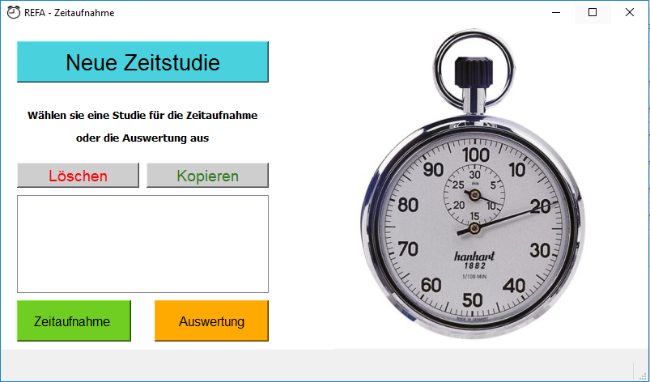
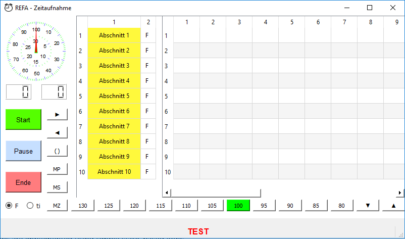
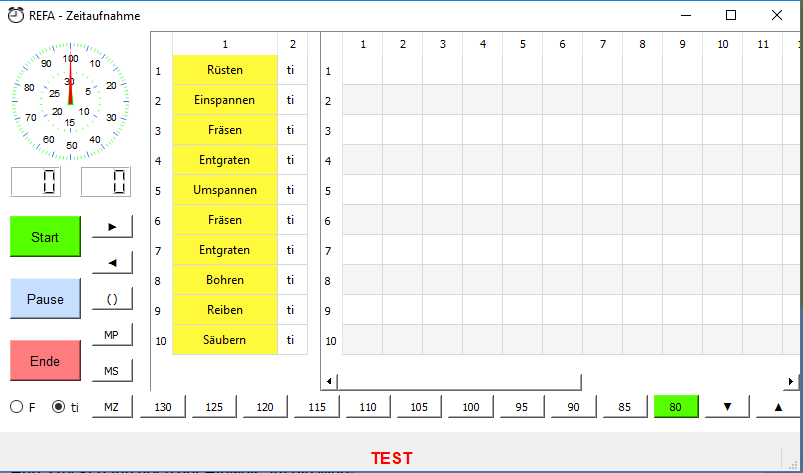
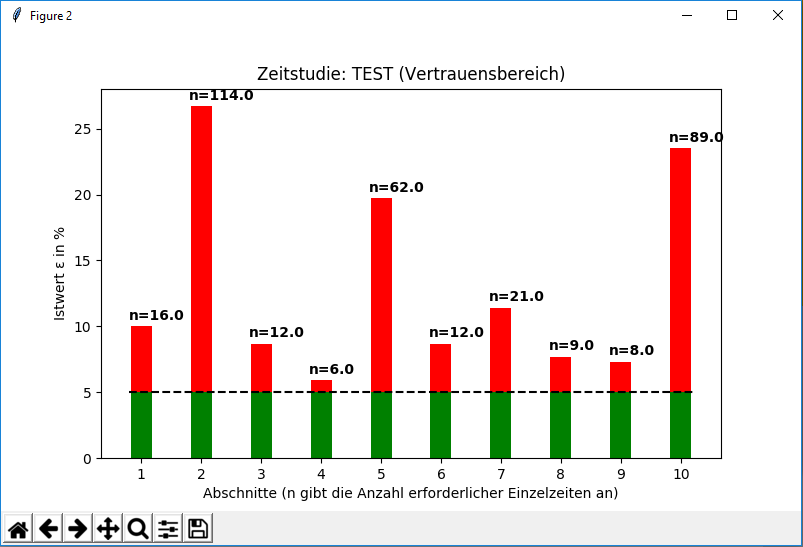
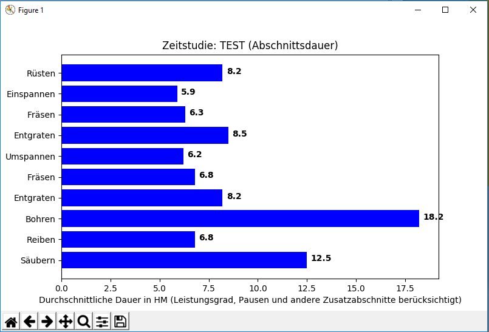

# REFA-Timekeeper
GUI for REFA time tracking with a Raspberry Pi, implemented in Python using PyQt5.

Use your Raspberry Pi in conjunction with a 7 inch lcd as a portable time recording device. 
Perform an evaluation right after the end of the time- and progress study 
or load the saved csv files on your pc for evaluation of the time studies.

